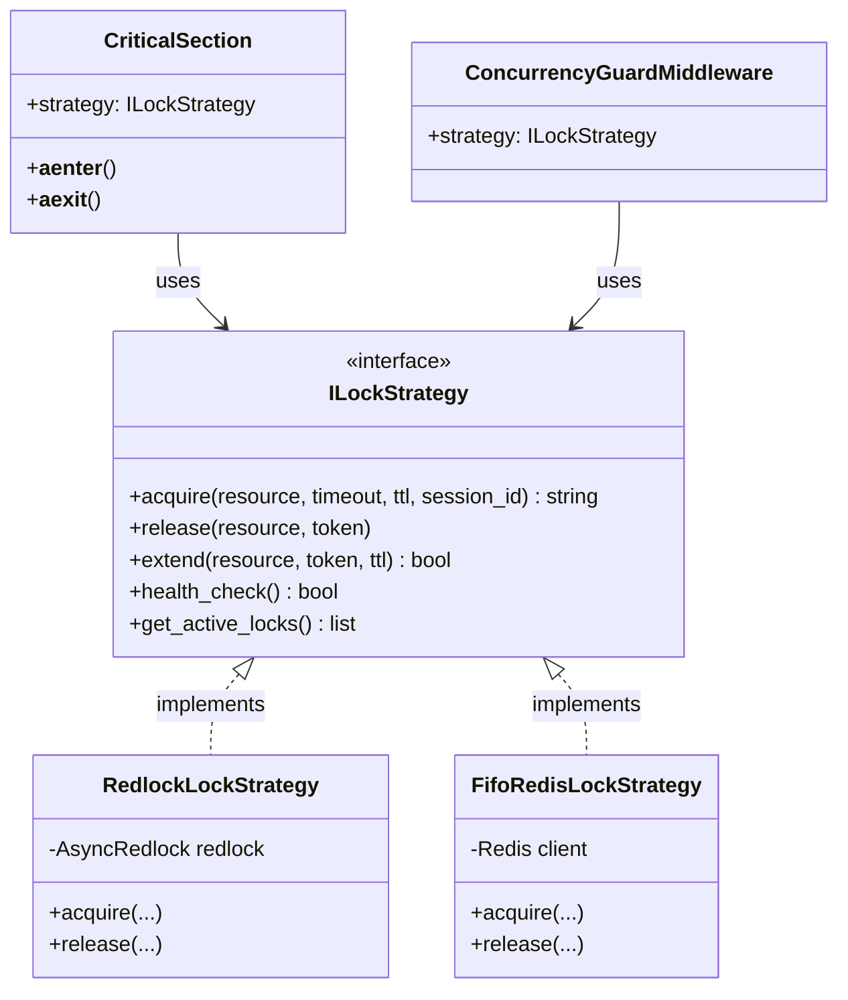
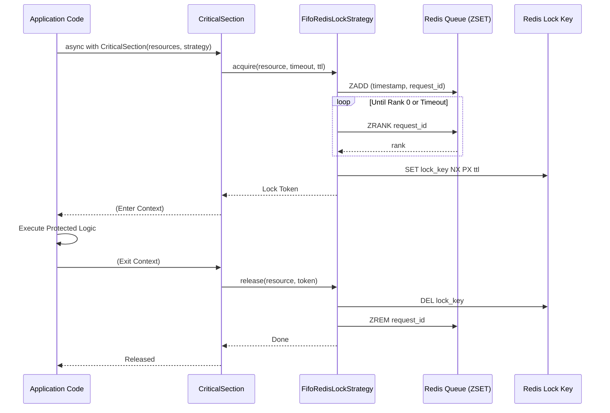
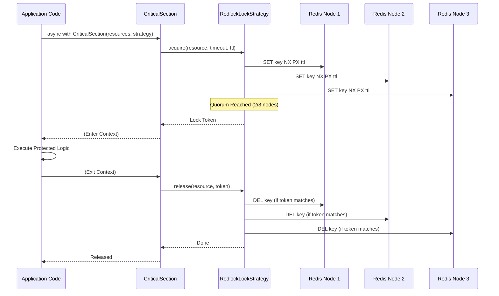

# cqrs-ddd-redis

[](https://pypi.org/project/cqrs-ddd-redis/)
[](https://pypi.org/project/cqrs-ddd-redis/)
[](https://opensource.org/licenses/MIT)

**Redis Integration for the CQRS/DDD Toolkit**

Distributed locking, health monitoring, and high-availability persistence adapters for building robust Domain-Driven Design systems with Python.

---

## Architecture

This package implements the `ILockStrategy` port from `cqrs-ddd-core`, providing distributed implementations via Redlock and FIFO algorithms.

### Component Relationship



---

## Features

- **Distributed Locking (Redlock)**: Production-grade Redlock algorithm implementation using redlock-ng.
- **Fair Locking (FIFO)**: Strict First-Come-First-Served locking strategy for ordered execution.
- **Reentrancy Support**: Supports nested execution flows via session_id and reference counting.
- **High Availability**: Support for multiple Redis instances with internal quorum-aware logic (Redlock).
- **Quorum Health Checks**: Real-time monitoring of Redis cluster health following strict Redlock protocols.
- **Technical Reliability**:
  - Unique tokens for safe releases.
  - Atomic TTL extensions via Lua scripts.
  - Proactive metadata pruning to ensure stable memory usage.

---

## Installation

```bash
pip install cqrs-ddd-redis
```

> [!NOTE]
> This package requires `cqrs-ddd-core`.

---

## Usage

### Distributed Locking (Redlock)

The `RedlockLockStrategy` is the recommended default for production environments with multiple Redis instances. It uses the Redlock algorithm to ensure safety and availability across a cluster.

```python
from cqrs_ddd_redis import RedlockLockStrategy

# Requires multiple Redis URLs for full Redlock reliability
strategy = RedlockLockStrategy([
    "redis://localhost:6379",
    "redis://localhost:6380",
    "redis://localhost:6381",
])
```

### Simple Distributed Locking (Fair/FIFO)

For single-node Redis deployments or scenarios requiring strict First-Come-First-Served (FIFO) order, use `FifoRedisLockStrategy`.

```python
from cqrs_ddd_redis import FifoRedisLockStrategy
from redis.asyncio import Redis

# Uses a single Redis client
redis_client = Redis.from_url("redis://localhost:6379")
strategy = FifoRedisLockStrategy(redis_client)
```

#### Fair Locking Flow (FIFO)

The `FifoRedisLockStrategy` uses a Redis ZSET as a wait-queue to ensure requests are served in the exact order they arrived.



### Distributed Locking Flow

The following diagram illustrates how the `CriticalSection` utility coordinates with the `RedlockLockStrategy` to reach a quorum across Redis nodes.



---

## Advanced Features

### Reentrant Locks

Use a `session_id` to allow the same execution flow to safely re-acquire the same lock.

```python
# Initial acquisition
token = await strategy.acquire(resource, session_id="tx-123")

# Nested call (same flow)
# Succeeds immediately and increments internal ref_count
nested_token = await strategy.acquire(resource, session_id="tx-123")

# Release only decrements ref_count
await strategy.release(resource, nested_token)

# Lock fully released in Redis only when count reaches 0
await strategy.release(resource, token)
```

### Health Monitoring

```python
# Returns True only if a quorum of nodes is responsive
is_healthy = await strategy.health_check()
```

---

## Configuration Reference

| Parameter | Type | Default | Description |
| :--- | :--- | :--- | :--- |
| `redis_urls` | `list[str]` | **Required** | List of connection strings (e.g., redis://localhost:6379). |
| `retry_count` | `int` | `1000` | Max attempts to reach quorum during acquisition. |
| `retry_delay_min` | `float` | `0.1` | Minimum jitter delay between retries. |
| `retry_delay_max` | `float` | `0.3` | Maximum jitter delay between retries. |

---

## License

This project is licensed under the MIT License - see the `LICENSE` file for details.
